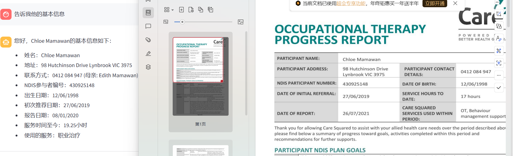

### 项目简述：

本项目是一个基于AI大模型的文档助手，通过AI的能力协助用户完成专业文档的编写和校队

#### 业务简单描述：

1. 尝试解析出来页面的数据结构
2. 把数据结构提取出来之后，发送到AI的API，获取API给出的推荐结果
3. 把AI的结果展示在页面上或者生成的带有答案的文档

#### 基本功：

1. 快速熟悉WPS的API和操作流程
2. 熟悉java & springboot&MySQL& Reids & Vue
3. 按照约定的要求，任务开始前，先用一个小的Task，看看展示一下的感受，态度，速度

#### 具体任务：

1.  尝试解析出来word页面的数据结构，把页面dom提取出来之后，发送到模拟的API，获取API给出的结果，填写页面上，保证数据的完整性

